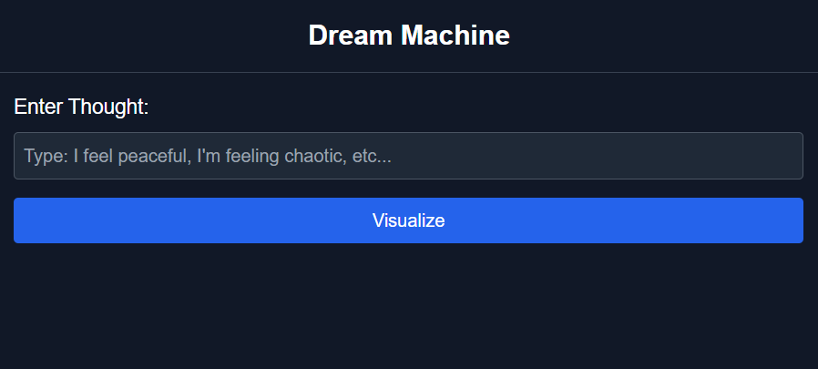

## the dream machine project over view 

### one of the options here is to use: "Perlin Noise / Shader Effects → Procedural dream-like visuals" 
 converting text to theme with processing the langugage like this image user can write their feeeling and creating this world based on that feeling (maybe user can share more deatile about the dream so we can further recreat that world )  

import React, { useEffect, useRef, useState } from "react";
import * as THREE from "three";

const DreamMachine = () => {
    const [sceneType, setSceneType] = useState("");
    const mountRef = useRef(null);

    const handleSceneChange = (e: React.ChangeEvent<HTMLSelectElement>) => {
        setSceneType(e.target.value);
    };

    useEffect(() => {
        if (!mountRef.current) return;

        const scene = new THREE.Scene();
        const camera = new THREE.PerspectiveCamera(75, window.innerWidth / window.innerHeight, 0.1, 1000);
        const renderer = new THREE.WebGLRenderer({ antialias: true });
        renderer.setSize(window.innerWidth, window.innerHeight);
        mountRef.current.appendChild(renderer.domElement);

        let animationFrameId: number;

        const renderScene = () => {
            switch (sceneType) {
                case "zen":
                    // Zen Garden Setup
                    const zenGeometry = new THREE.BoxGeometry();
                    const zenMaterial = new THREE.MeshBasicMaterial({ color: 0x00ff00 });
                    const zenCube = new THREE.Mesh(zenGeometry, zenMaterial);
                    scene.add(zenCube);
                    camera.position.z = 5;
                    const zenAnimate = () => {
                        requestAnimationFrame(zenAnimate);
                        zenCube.rotation.x += 0.01;
                        zenCube.rotation.y += 0.01;
                        renderer.render(scene, camera);
                    };
                    zenAnimate();
                    break;
                case "chaos":
                    // Chaotic Storm Setup
                    const chaosGeometry = new THREE.SphereGeometry(1, 32, 32);
                    const chaosMaterial = new THREE.MeshStandardMaterial({ color: 0xff0000, wireframe: true });
                    const chaosSphere = new THREE.Mesh(chaosGeometry, chaosMaterial);
                    scene.add(chaosSphere);
                    camera.position.z = 5;
                    const chaosLight = new THREE.PointLight(0xffffff, 1, 100);
                    chaosLight.position.set(10, 10, 10);
                    scene.add(chaosLight);
                    const chaosAnimate = () => {
                        requestAnimationFrame(chaosAnimate);
                        chaosSphere.rotation.x += 0.02;
                        chaosSphere.rotation.y += 0.03;
                        renderer.render(scene, camera);
                    };
                    chaosAnimate();
                    break;
                case "cyber":
                    // Cyber City Setup
                    const cyberGeometry = new THREE.CylinderGeometry(0.5, 0.5, 2, 32);
                    const cyberMaterial = new THREE.MeshPhongMaterial({ color: 0x00ffff, emissive: 0x00ffff });
                    const cyberCylinder = new THREE.Mesh(cyberGeometry, cyberMaterial);
                    scene.add(cyberCylinder);
                    camera.position.z = 5;
                    const cyberLight = new THREE.DirectionalLight(0xffffff, 0.8);
                    cyberLight.position.set(5, 10, 7);
                    scene.add(cyberLight);
                    const cyberAnimate = () => {
                        requestAnimationFrame(cyberAnimate);
                        cyberCylinder.rotation.x += 0.01;
                        cyberCylinder.rotation.y += 0.02;
                        renderer.render(scene, camera);
                    };
                    cyberAnimate();
                    break;
                case "myth":
                    // Mythical Dragon Setup
                    const mythGeometry = new THREE.TorusKnotGeometry(1, 0.4, 100, 16);
                    const mythMaterial = new THREE.MeshToonMaterial({ color: 0xffd700 });
                    const mythTorus = new THREE.Mesh(mythGeometry, mythMaterial);
                    scene.add(mythTorus);
                    camera.position.z = 5;
                    const mythLight = new THREE.AmbientLight(0xffffff, 0.5);
                    scene.add(mythLight);
                    const mythAnimate = () => {
                        requestAnimationFrame(mythAnimate);
                        mythTorus.rotation.x += 0.01;
                        mythTorus.rotation.y += 0.01;
                        renderer.render(scene, camera);
                    };
                    mythAnimate();
                    break;
                default:
                    break;
            }
        };

        renderScene();

        return () => {
            if (animationFrameId) cancelAnimationFrame(animationFrameId);
            mountRef.current.removeChild(renderer.domElement);
        };
    }, [sceneType]);

    return (
        

            <h1 className="text-3xl font-bold mb-6">Dream Machine</h1>
            
Choose a dream scene from the dropdown!

            

                <select value={sceneType} onChange={handleSceneChange} className="w-full px-4 py-2 rounded-md border border-gray-700 bg-gray-800 text-white focus:outline-none focus:border-blue-500 transition">
                    <option value="">Select a Dream Scene</option>
                    <option value="zen">Peaceful Zen Garden</option>
                    <option value="chaos">Chaotic Storm</option>
                    <option value="cyber">Cyber City</option>
                    <option value="myth">Mythical Dragon</option>
                </select>
            

            

        

    );
};

export default DreamMachine;